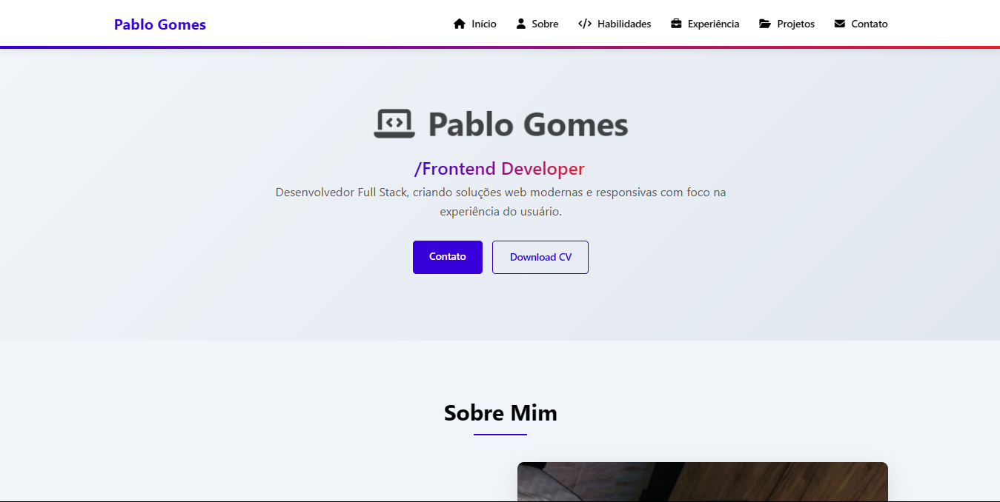

#  Portfólio - Pablo Gomes 

Portfólio profissional desenvolvido para mostrar meus projetos, habilidades e experiência como **Desenvolvedor Full Stack**.

  

## ✨ Destaques

- 🎨 **Design moderno** e responsivo
- 📱 **Mobile-first** com adaptação para desktop
- ⚡ **Performance otimizada**
- 🌐 **Multiplataforma** (testado em Chrome, Firefox e Edge)

## 🛠️ Stack Tecnológica

| Tecnologia | Descrição |
|------------|-----------|
|  HTML5 | Estrutura semântica |
|  CSS3 | Estilização avançada |
|  JavaScript | Interatividade |

## 🚀 Acesso Online

🔗 **[Acesse meu portfólio aqui](https://pablog-7.github.io/meu-portifolio/)**
